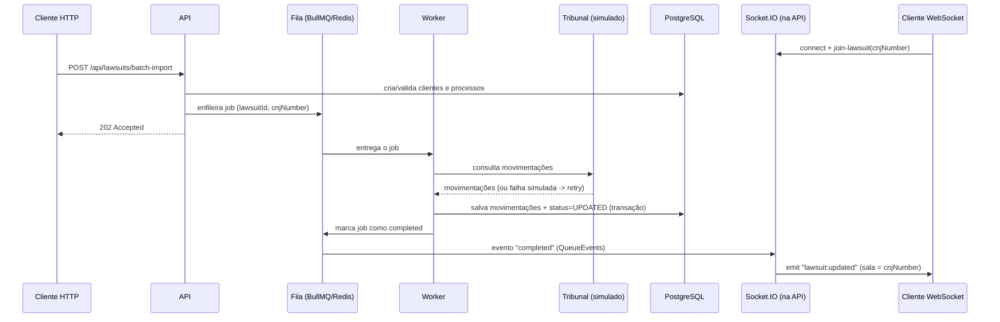

# JurisEngine — Motor Jurídico Assíncrono

API + Worker assíncrono para captação de andamentos processuais: recebe processos judiciais (número CNJ) vinculados a clientes e, em segundo plano, busca as movimentações mais recentes de cada processo, salva no banco e notifica o cliente em tempo real via WebSocket assim que termina.

Projeto de estudo — uma versão em miniatura do que existe por trás de qualquer sistema jurídico (Projuris, Astrea, etc.), construído fase a fase. O passo a passo completo de como cada peça foi construída (para quem quiser reproduzir do zero) está em [`Estudos/GUIA COMPLETO - Passo a Passo/`](./Estudos/GUIA%20COMPLETO%20-%20Passo%20a%20Passo/00%20-%20Leia-me%20Primeiro.md).

## Por que "assíncrono"

Consultar um tribunal é lento e não confiável. Se a API fizesse essa consulta na hora que o cliente pede, importar 500 processos deixaria o usuário esperando minutos, e qualquer instabilidade de rede quebraria a resposta inteira. Por isso a API só grava a intenção numa fila e responde na hora — um Worker separado processa em background, com retry automático, e avisa o cliente por WebSocket quando terminar.

## Arquitetura

```mermaid
flowchart LR
    Client(["Cliente HTTP<br/>(curl / Postman)"])
    API["API<br/>Express + TypeScript<br/>(src/app.ts)"]
    PG[("PostgreSQL<br/>clients · lawsuits · movements<br/>dead_letter_jobs")]
    Queue["Fila lawsuit-sync<br/>(BullMQ)"]
    Redis[("Redis")]
    Worker["Worker<br/>(src/workers/lawsuitSync.worker.ts)"]
    Tribunal["Simulador do Tribunal<br/>(delay + falha aleatória)"]
    WS["Socket.IO<br/>(salas por número CNJ)"]
    WSClient(["Cliente WebSocket<br/>(conectado na sala do CNJ)"])
    Board["Bull Board<br/>/admin/queues"]

    Client -- "POST /api/lawsuits/batch-import" --> API
    API -- grava --> PG
    API -- enfileira job --> Queue
    Queue <-.-> Redis
    Worker -- consome --> Queue
    Worker -- consulta --> Tribunal
    Worker -- grava movimentação<br/>+ atualiza status --> PG
    Worker -. evento "completed" via QueueEvents .-> WS
    WS -- "lawsuit:updated" --> WSClient
    Board -.-> Queue

    style API fill:#4f7cff,color:#fff
    style Worker fill:#4f7cff,color:#fff
    style WS fill:#7c4fff,color:#fff
```

**Por que Worker e API são processos separados?** São dois processos Node independentes — a API responde HTTP rapidamente e não pode ficar presa esperando uma consulta lenta a um tribunal; o Worker pode demorar o quanto precisar sem afetar a capacidade de resposta da API. Isso também permite escalar cada um de forma independente (ver PM2, mais abaixo).

**Por que o Worker não emite o WebSocket diretamente?** Porque ele roda num processo diferente do processo que hospeda o Socket.IO (a API). A ponte é feita via BullMQ `QueueEvents`, que escuta o evento `completed` da fila e repassa para a sala certa — nenhum acoplamento direto entre os dois processos.

### Fluxo de uma sincronização, passo a passo



## Stack

| Camada | Tecnologia |
|---|---|
| Linguagem / Runtime | TypeScript · Node.js 22 |
| API HTTP | Express 5 |
| ORM / Banco | Sequelize · PostgreSQL 16 |
| Fila / Jobs | BullMQ sobre Redis 7 |
| Tempo real | Socket.IO (+ `@socket.io/redis-adapter` em produção/cluster) |
| Processos em produção | PM2 (`pm2-runtime`) — API em modo `cluster`, Worker em modo `fork` |
| Testes | Jest · ts-jest · supertest, banco Postgres isolado (`_test`) |
| Containerização | Docker + Docker Compose (multi-stage: dev / build / production) |

## Como rodar (um único comando)

Pré-requisitos: Docker Desktop instalado. Nada mais precisa ser instalado na sua máquina para subir o projeto.

```bash
# 1. Clone o repositório
git clone <url-do-seu-repositorio>
cd Sistema_Treino

# 2. Copie o modelo de variáveis de ambiente
cp .env.example .env

# 3. Suba tudo (api + worker + Postgres + Redis) com um único comando
docker compose up --build

# 4. Em outro terminal: aplique as migrations
npm install        # só para ter o sequelize-cli disponível localmente
npm run db:migrate

# 5. (opcional) Popule com dados de exemplo
npm run db:seed
```

A partir daqui:

| Recurso | Endereço |
|---|---|
| API | http://localhost:3000 |
| Health check | http://localhost:3000/health |
| Dashboard das filas (Bull Board) | http://localhost:3000/admin/queues (usuário/senha do `.env`) |
| Postgres | localhost:5432 |
| Redis | localhost:6379 |

## Endpoints principais

| Método | Rota | Descrição |
|---|---|---|
| `POST` | `/api/clients` | Cria um cliente |
| `GET` | `/api/clients?page=&limit=` | Lista clientes (paginado) |
| `GET` | `/api/clients/:id` | Busca um cliente |
| `POST` | `/api/lawsuits` | Vincula um processo (CNJ) a um cliente |
| `GET` | `/api/lawsuits/:id` | Busca um processo, com cliente e movimentações |
| `POST` | `/api/lawsuits/batch-import` | Enfileira uma ou mais sincronizações em lote (`202 Accepted`) |

Exemplos completos de `curl` para cada rota estão na [Fase 3](./Estudos/GUIA%20COMPLETO%20-%20Passo%20a%20Passo/03%20-%20Fase%203%20-%20API%20REST.md) e no [Checklist Final](./Estudos/GUIA%20COMPLETO%20-%20Passo%20a%20Passo/) do guia.

## Testes

```bash
docker compose up -d db redis
docker exec -it jurisengine_db psql -U postgres -c "CREATE DATABASE juris_db_test;"   # só na primeira vez
npm run db:migrate:test
npm test
```

Suíte com testes unitários (validação do número CNJ — formato + dígito verificador oficial) e testes de integração (fluxo HTTP completo de clientes e processos), contra um banco Postgres isolado (`juris_db_test`) — nunca o de desenvolvimento. Detalhes em [`07 - Fase 7 - Testes Automatizados (Jest).md`](./Estudos/GUIA%20COMPLETO%20-%20Passo%20a%20Passo/07%20-%20Fase%207%20-%20Testes%20Automatizados%20\(Jest\).md).

## Produção (PM2 + Docker)

Em produção, a API roda em modo **cluster** (uma instância por núcleo de CPU) e o Worker em modo **fork** (réplicas independentes), ambos gerenciados por `pm2-runtime` dentro do container:

```bash
docker build --target production -t jurisengine:prod .
docker run --rm -it --env-file .env -p 3000:3000 jurisengine:prod
```

Detalhes de por que cada escolha foi feita (cluster vs fork, Redis Adapter do Socket.IO, `pm2-runtime` vs `pm2`) em [`06 - Fase 6 - PM2 (Producao).md`](./Estudos/GUIA%20COMPLETO%20-%20Passo%20a%20Passo/06%20-%20Fase%206%20-%20PM2%20\(Producao\).md).

## Padrão de commits

Este repositório segue [Conventional Commits](https://www.conventionalcommits.org/): `<tipo>: <descrição no imperativo>`.

| Tipo | Quando usar |
|---|---|
| `feat:` | uma funcionalidade nova (ex.: `feat: adicionar sincronização em tempo real via WebSocket`) |
| `fix:` | correção de um bug (ex.: `fix: enviar REDIS_HOST correto para o container da API`) |
| `docs:` | mudanças só de documentação (README, guias em `Estudos/`) |
| `test:` | adicionar ou ajustar testes, sem mudar comportamento |
| `chore:` | manutenção que não afeta o código de produção (config, dependências, `.gitattributes`) |
| `refactor:` | mudança interna de código sem alterar comportamento externo |

Mensagens curtas, no imperativo, descrevendo **o que** a mudança faz — não uma lista do que foi mexido. Um corpo opcional (linha em branco + parágrafo) pode explicar o "por quê" quando não for óbvio.

## Estrutura do projeto

```
src/
├── app.ts / server.ts     # Express (sem escutar porta) / entrypoint (http.Server + Socket.IO)
├── config/                # Sequelize, conexão Postgres, conexão Redis compartilhada
├── controllers/, routes/  # camada HTTP
├── middlewares/           # AppError, asyncHandler, errorHandler
├── models/, database/     # models Sequelize, migrations, seeders
├── queues/, workers/      # fila BullMQ e o Worker que a consome
├── websocket/             # Socket.IO + ponte BullMQ -> WebSocket
├── utils/                 # validador de número CNJ
└── admin/                 # Bull Board (dashboard das filas)
tests/                     # Jest: unitários + integração
Estudos/                   # guia de estudo completo, fase a fase
```

Guia completo, com o código de cada arquivo comentado linha a linha como se fosse uma aula: [`Estudos/GUIA COMPLETO - Passo a Passo/00 - Leia-me Primeiro.md`](./Estudos/GUIA%20COMPLETO%20-%20Passo%20a%20Passo/00%20-%20Leia-me%20Primeiro.md).
